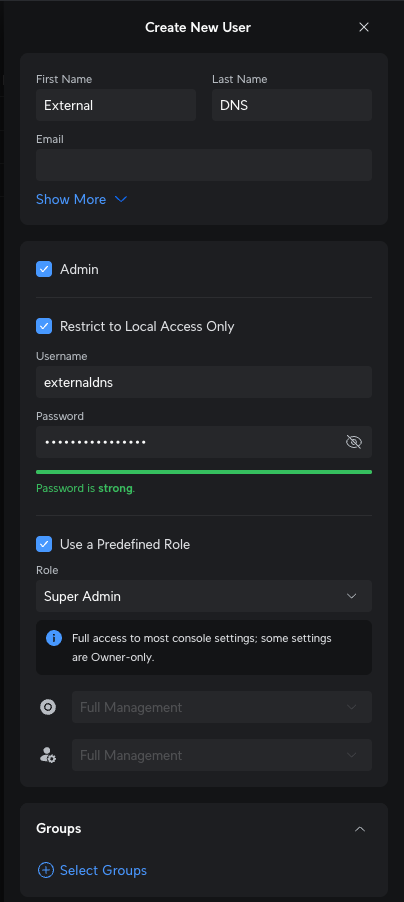
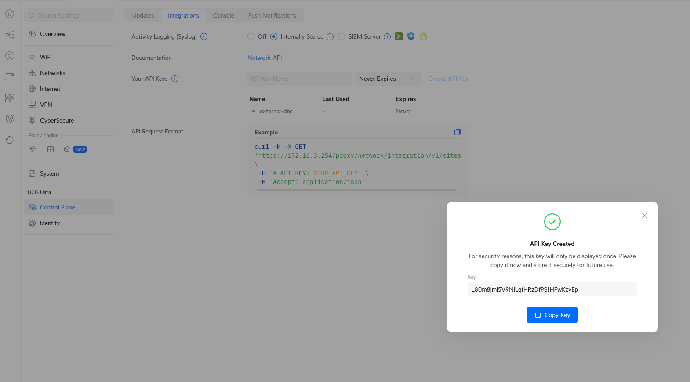
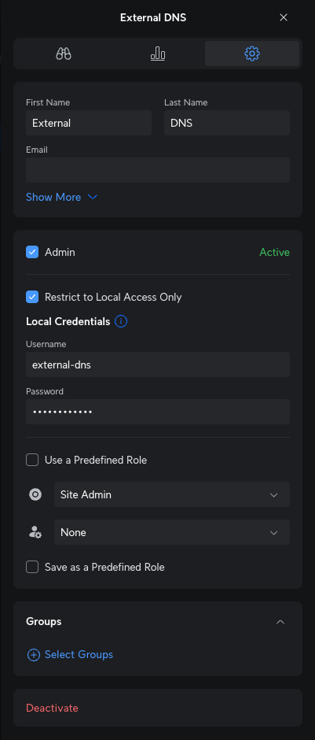

# ExternalDNS Webhook Provider for UniFi

<div align="center">

[](https://github.com/kashalls/external-dns-unifi-webhook/releases)&nbsp;&nbsp;
[](https://discord.gg/home-operations)

</div>

[ExternalDNS](https://github.com/kubernetes-sigs/external-dns) is a Kubernetes add-on for automatically managing DNS records for Kubernetes ingresses and services by using different DNS providers. This webhook provider allows you to automate DNS records from your Kubernetes clusters into your UniFi Network controller.

## 🎯 Requirements

- ExternalDNS >= v0.14.0
- UniFi OS >= 3.x
- UniFi Network >= 8.2.93

## 🚫 Limitations

*UniFi uses [dnsmasq](https://dnsmasq.org) as the backend of it's dns resolver and dhcp server.*
*This project is subject to the limitations of dnsmasq. Please report any issues you encounter utilizing this provider.*

- Wildcard and Duplicate CNAME Records are not supported by UniFi.
  - *.example.com 0 IN CNAME internal.example.com
  - deployment.example.com 0 IN CNAME external.example.com internal.example.com

## ⛵ Deployment

### Creating UniFi Credentials

ExternalDNS Provider for UniFi supports 2 styles of authentication:

- UniFi API Key
- Username & Password (Deprecated)

Click the below headers to view the instructions:

<details>
<summary>UniFi Api Key - Network v9.0.0+</summary>
<br>

1. Open your UniFi controller/Console's admin page either via [unifi.ui.com](https://unifi.ui.com) or via the IP address of your controller

2. On the left navigation bar (that runs the length of the page) click the *people* icon (`Admin & Users`)

3. Click `+ Create New` at the top of the page and fill it out using the below details

| Field Name                    | Value                                   |
|-------------------------------|-----------------------------------------|
| First name                    | `External`                              |
| Last name                     | `DNS`                                   |
| Admin                         | :white_check_mark:                      |
| Restrict to local access only | :white_check_mark:                      |
| Username                      | `externaldns`                           |
| Password                      | Make up a password, but make note of it |
| Use a pre defined role        | :white_check_mark:                      |
| Role                          | `Super Admin`                           |

Your user should now look like the below



4. Login to your console as the user you have just created. This will need to be done via the controller's IP address

5. **Gear Icon** > **Control Plane** > **Integrations**

Give the API key a name, something like `external-dns`

Copy this Key, we will need it later. Your page should now look like the below



6. Remove elevated permissions from the user

Log back in as your normal account, head over to where we created the External DNS account
(On the left navigation bar (that runs the length of the page) click the *people* icon (`Admin & Users`))

Open that account, click the **Gear Icon** then match the below

We have unselected **Use a Predefined Role** and changed the *ufo* icon to `Site admin` and the *person* to `None`



You're probably thinking *wow, that was long*, and it's because only super admins can create API Keys, but they do not need
those permissions the entire time to be able to *have* API Key attached to that user. It's a ~bug~ feature in UniFi

The `Site Admin` permissions are more than enough to allow that user to create and manage DNS records in our controller

7. Create a Kubernetes secret called `external-dns-unifi-secret` that will hold your `UNIFI_API_KEY` with their respected values from Step 3.

```yaml
---
apiVersion: v1
kind: Secret
metadata:
    name: external-dns-unifi-secret
stringData:
  api-key: <your-api-key>
```

You should now follow the [Installing the provider](#installing-the-provider) instructions

</details>

<details>
<summary>Username & Password (Deprecated)</summary>
<br>

1. Open your UniFi Console's Network Settings and go to `Settings > Control Plane > Admins & Users`.

2. Select `Create New Admin`.

3. In the menu that appears, enable `Restrict to Local Access Only`. Deselect `Use a Predefined Role`. Set `Network: Site Admin`. All other selections can be set to `None`. Click `Create`.

4. Create a Kubernetes secret called `external-dns-unifi-secret` that holds the `username` and `password` with their respected values from Step 3.

```yaml
---
apiVersion: v1
kind: Secret
metadata:
    name: external-dns-unifi-secret
stringData:
  username: <your-username>
  password: <your-password>
```

</details>

### Installing the provider

1. Add the ExternalDNS Helm repository to your cluster.

    ```sh
    helm repo add external-dns https://kubernetes-sigs.github.io/external-dns/
    ```

2. Deploy your `external-dns-unifi-secret` secret that holds your authentication credentials from either of the credential types above.

3. Create the helm values file, for example `external-dns-unifi-values.yaml`:

    ```yaml
    fullnameOverride: external-dns-unifi
    logLevel: &logLevel debug
    provider:
      name: webhook
      webhook:
        image:
          repository: ghcr.io/kashalls/external-dns-unifi-webhook
          tag: main # replace with a versioned release tag
        env:
          - name: UNIFI_HOST
            value: https://192.168.1.1 # replace with the address to your UniFi router/controller
          - name: UNIFI_EXTERNAL_CONTROLLER
            value: "false"
          - name: UNIFI_API_KEY
            valueFrom:
              secretKeyRef:
                name: external-dns-unifi-secret
                key: api-key
          - name: LOG_LEVEL
            value: *logLevel
        livenessProbe:
          httpGet:
            path: /healthz
            port: http-webhook
          initialDelaySeconds: 10
          timeoutSeconds: 5
        readinessProbe:
          httpGet:
            path: /readyz
            port: http-webhook
          initialDelaySeconds: 10
          timeoutSeconds: 5
    extraArgs:
      - --ignore-ingress-tls-spec
    policy: sync
    sources: ["ingress", "service"]
    txtOwnerId: default
    txtPrefix: k8s.
    domainFilters: ["example.com"] # replace with your domain
    ```

4. Install the Helm chart

    ```sh
    helm install external-dns-unifi external-dns/external-dns -f external-dns-unifi-values.yaml --version 1.15.0 -n external-dns
    ```

## Configuration

### Unifi Controller Configuration

| Environment Variable         | Description                                                       | Default Value |
|------------------------------|-------------------------------------------------------------------|---------------|
| `UNIFI_API_KEY`              | The local api key provided for your user                          | N/A           |
| `UNIFI_USER`                 | Username for the Unifi Controller (deprecated use `UNIFI_API_KEY`). | N/A           |
| `UNIFI_PASS`                 | Password for the Unifi Controller (deprecated use `UNIFI_API_KEY`). | N/A           |
| `UNIFI_SKIP_TLS_VERIFY`      | Whether to skip TLS verification (true or false).                 | `true`        |
| `UNIFI_SITE`                 | Unifi Site Identifier (used in multi-site installations)          | `default`     |
| `UNIFI_HOST`                 | Host of the Unifi Controller (must be provided).                  | N/A           |
| `UNIFI_EXTERNAL_CONTROLLER`* | Toggles support for non-UniFi Hardware                            | `false`       |
| `LOG_LEVEL`                  | Change the verbosity of logs (used when making a bug report)      | `info`        |

*`UNIFI_EXTERNAL_CONTROLLER` is used to toggle between two versions of the Network Controller API. If you are running the UniFi software outside of UniFi's official hardware (e.g., Cloud Key or Dream Machine), you'll need to set `UNIFI_EXTERNAL_CONTROLLER` to `true`

### Server Configuration

| Environment Variable             | Description                                                      | Default Value |
|----------------------------------|------------------------------------------------------------------|---------------|
| `SERVER_HOST`                    | The host address where the server listens.                       | `localhost`   |
| `SERVER_PORT`                    | The port where the server listens.                               | `8888`        |
| `SERVER_READ_TIMEOUT`            | Duration the server waits before timing out on read operations.  | N/A           |
| `SERVER_WRITE_TIMEOUT`           | Duration the server waits before timing out on write operations. | N/A           |
| `DOMAIN_FILTER`                  | List of domains to include in the filter.                        | Empty         |
| `EXCLUDE_DOMAIN_FILTER`          | List of domains to exclude from filtering.                       | Empty         |
| `REGEXP_DOMAIN_FILTER`           | Regular expression for filtering domains.                        | Empty         |
| `REGEXP_DOMAIN_FILTER_EXCLUSION` | Regular expression for excluding domains from the filter.        | Empty         |

## ⭐ Stargazers

<div align="center">

[](https://star-history.com/#kashalls/external-dns-unifi-webhook&Date)

</div>

---

## 🤝 Gratitude and Thanks

Thanks to all the people who donate their time to the [Home Operations](https://discord.gg/home-operations) Discord community.
