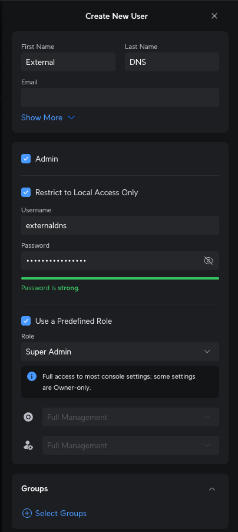
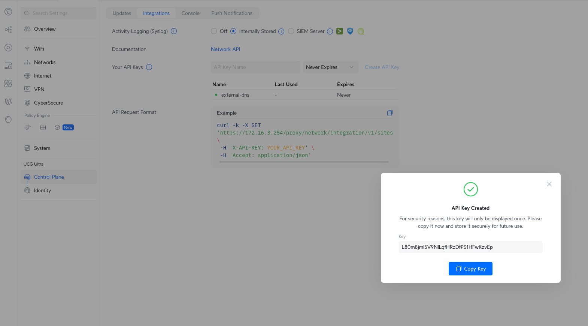
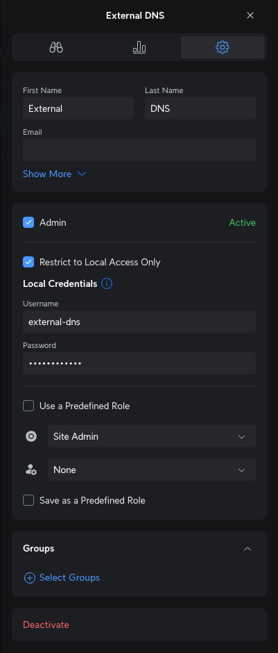

# ExternalDNS Webhook Provider for UniFi

<div align="center">

[](https://github.com/kashalls/external-dns-unifi-webhook/releases)&nbsp;&nbsp;
[](https://discord.gg/home-operations)

</div>

[ExternalDNS](https://github.com/kubernetes-sigs/external-dns) is a Kubernetes add-on for automatically managing DNS records for Kubernetes ingresses and services by using different DNS providers. This webhook provider allows you to automate DNS records from your Kubernetes clusters into your UniFi Network controller.

## 🎯 Requirements

- ExternalDNS >= v0.14.0
- UniFi OS >= 3.x
- UniFi Network >= 8.2.93

## 🚫 Limitations

*UniFi uses [dnsmasq](https://dnsmasq.org) as the backend of it's dns resolver and dhcp server.*
*This project is subject to the limitations of dnsmasq. Please report any issues you encounter utilizing this provider.*

- Wildcard and Duplicate CNAME Records are not supported by UniFi.
  - *.example.com 0 IN CNAME internal.example.com
  - deployment.example.com 0 IN CNAME external.example.com internal.example.com
- When using the **Integration API** (`UNIFI_INTEGRATION_API=true`), NS records are silently skipped and `UNIFI_API_KEY` is required — username/password auth is rejected at startup.

## ⛵ Deployment

### Connection Modes

The provider supports four connection modes. Choose the combination that matches your setup:

| Mode | `UNIFI_HOST` | Extra flags | Auth | API used |
|------|-------------|-------------|------|----------|
| **Local (default)** | `https://192.168.1.1` | — | API key or user/pass | Static DNS (`/proxy/network/v2/api/…`) |
| **External Controller** | `https://myserver:8443` | `UNIFI_EXTERNAL_CONTROLLER=true` | API key or user/pass | Static DNS (`/v2/api/…`) |
| **Cloud Connector** | any (overridden automatically) | `UNIFI_CLOUD_CONNECTOR=true` + `UNIFI_CLOUD_CONSOLE_ID=<id>` | **API key only** | Static DNS via `api.ui.com` proxy |
| **Integration API — local** | `https://192.168.1.1` | `UNIFI_INTEGRATION_API=true` | **API key only** | Integration API (`/proxy/network/integration/v1/…`) |
| **Integration API — cloud** | any (overridden automatically) | `UNIFI_CLOUD_CONNECTOR=true` + `UNIFI_CLOUD_CONSOLE_ID=<id>` + `UNIFI_INTEGRATION_API=true` | **API key only** | Integration API via `api.ui.com` proxy |

> **Integration API** is the newer UniFi Network API (`/proxy/network/integration/v1/sites/{siteId}/dns/policies`).
> It requires `UNIFI_API_KEY` — username/password authentication is not supported and the provider will
> refuse to start if `UNIFI_INTEGRATION_API=true` without an API key set.
> NS records are not supported by this API and will be silently skipped. All other record types (A, AAAA, CNAME, MX, TXT, SRV) are fully supported.

### Creating UniFi Credentials

ExternalDNS Provider for UniFi supports 2 styles of authentication:

- UniFi API Key (Console Firmware >= 4.3.6)
- Username & Password
- Unifi Cloud Connector (Console Firmware >= 5.0.3)
  - https://unifi.ui.com/settings/api-keys

Click the below headers to view the instructions:

<details>
<summary>UniFi Api Key - Network v9.0.0+</summary>
<br>

1. Open your UniFi controller/Console's admin page either via [unifi.ui.com](https://unifi.ui.com) or via the IP address of your controller

2. On the left navigation bar (that runs the length of the page) click the *people* icon (`Admin & Users`)

3. Click `+ Create New` at the top of the page and fill it out using the below details

| Field Name                    | Value                                   |
|-------------------------------|-----------------------------------------|
| First name                    | `External`                              |
| Last name                     | `DNS`                                   |
| Admin                         | :white_check_mark:                      |
| Restrict to local access only | :white_check_mark:                      |
| Username                      | `externaldns`                           |
| Password                      | Make up a password, but make note of it |
| Use a pre defined role        | :white_check_mark:                      |
| Role                          | `Super Admin`                           |

Your user should now look like the below



4. Login to your console as the user you have just created. This will need to be done via the controller's IP address

5. **Gear Icon** > **Control Plane** > **Integrations**

Give the API key a name, something like `external-dns`

Copy this Key, we will need it later. Your page should now look like the below



6. Remove elevated permissions from the user

Log back in as your normal account, head over to where we created the External DNS account
(On the left navigation bar (that runs the length of the page) click the *people* icon (`Admin & Users`))

Open that account, click the **Gear Icon** then match the below

We have unselected **Use a Predefined Role** and changed the *ufo* icon to `Site admin` and the *person* to `None`



You're probably thinking *wow, that was long*, and it's because only super admins can create API Keys, but they do not need
those permissions the entire time to be able to *have* API Key attached to that user. It's a ~bug~ feature in UniFi

The `Site Admin` permissions are more than enough to allow that user to create and manage DNS records in our controller

7. Create a Kubernetes secret called `external-dns-unifi-secret` that will hold your `UNIFI_API_KEY` with their respected values from Step 3.

```yaml
---
apiVersion: v1
kind: Secret
metadata:
    name: external-dns-unifi-secret
stringData:
  api-key: <your-api-key>
```

You should now follow the [Installing the provider](#installing-the-provider) instructions

</details>

<details>
<summary>Username & Password (Deprecated)</summary>
<br>

1. Open your UniFi Console's Network Settings and go to `Settings > Control Plane > Admins & Users`.

2. Select `Create New Admin`.

3. In the menu that appears, enable `Restrict to Local Access Only`. Deselect `Use a Predefined Role`. Set `Network: Site Admin`. All other selections can be set to `None`. Click `Create`.

4. Create a Kubernetes secret called `external-dns-unifi-secret` that holds the `username` and `password` with their respected values from Step 3.

```yaml
---
apiVersion: v1
kind: Secret
metadata:
    name: external-dns-unifi-secret
stringData:
  username: <your-username>
  password: <your-password>
```

</details>

<details>
<summary>UniFi Cloud Connector</summary>
<br>

The Cloud Connector lets the provider reach your local console through Ubiquiti's cloud proxy at
`api.ui.com` — no VPN or port-forwarding required.

1. Log in to [unifi.ui.com](https://unifi.ui.com) and navigate to **Settings → API Keys**.

2. Create an API key and copy it.

3. Find your **Console ID** using either method below:

   **Option A — browser URL**
   Open [unifi.ui.com](https://unifi.ui.com), navigate to your console, and copy the UUID from the URL:
   ```
   https://unifi.ui.com/consoles/<console-id>/...
   ```

   **Option B — API**
   Query the Ubiquiti account API with your API key. The `id` field in each returned object is the Console ID:
   ```sh
   curl -s "https://api.ui.com/v1/hosts" \
     -H "X-API-Key: <your-api-key>" | jq '.[].id'
   ```

4. Create a Kubernetes secret:

```yaml
---
apiVersion: v1
kind: Secret
metadata:
    name: external-dns-unifi-secret
stringData:
  api-key: <your-api-key>
```

5. Set the following environment variables in your Helm values (see [Installing the provider](#installing-the-provider)):

```yaml
- name: UNIFI_API_KEY
  valueFrom:
    secretKeyRef:
      name: external-dns-unifi-secret
      key: api-key
- name: UNIFI_CLOUD_CONNECTOR
  value: "true"
- name: UNIFI_CLOUD_CONSOLE_ID
  value: "<your-console-id>"
```

To additionally use the new Integration API add:

```yaml
- name: UNIFI_INTEGRATION_API
  value: "true"
```

</details>

### Installing the provider

1. Add the ExternalDNS Helm repository to your cluster.

    ```sh
    helm repo add external-dns https://kubernetes-sigs.github.io/external-dns/
    ```

2. Deploy your `external-dns-unifi-secret` secret that holds your authentication credentials from either of the credential types above.

3. Create the helm values file, for example `external-dns-unifi-values.yaml`:

    ```yaml
    fullnameOverride: external-dns-unifi
    logLevel: &logLevel debug
    provider:
      name: webhook
      webhook:
        image:
          repository: ghcr.io/kashalls/external-dns-unifi-webhook
          tag: main # replace with a versioned release tag
        env:
          - name: UNIFI_HOST
            value: https://192.168.1.1 # replace with the address to your UniFi router/controller
          - name: UNIFI_EXTERNAL_CONTROLLER
            value: "false"
          - name: UNIFI_API_KEY
            valueFrom:
              secretKeyRef:
                name: external-dns-unifi-secret
                key: api-key
          - name: LOG_LEVEL
            value: *logLevel
        livenessProbe:
          httpGet:
            path: /healthz
            port: http-webhook
          initialDelaySeconds: 10
          timeoutSeconds: 5
        readinessProbe:
          httpGet:
            path: /readyz
            port: http-webhook
          initialDelaySeconds: 10
          timeoutSeconds: 5
    extraArgs:
      - --ignore-ingress-tls-spec
    policy: create-only
    sources: ["ingress", "service"]
    txtOwnerId: default
    txtPrefix: k8s.
    domainFilters: ["example.com"] # replace with your domain
    ```

    For additional customization, refer to the [helm values](https://github.com/kubernetes-sigs/external-dns/blob/master/charts/external-dns/values.yaml).

4. Install the Helm chart

    ```sh
    helm install external-dns-unifi external-dns/external-dns -f external-dns-unifi-values.yaml --version 1.15.0 -n external-dns
    ```

## Configuration

### UniFi Controller Configuration

| Environment Variable         | Description                                                                           | Default Value |
|------------------------------|---------------------------------------------------------------------------------------|---------------|
| `UNIFI_HOST`                 | Base URL of your UniFi controller (e.g. `https://192.168.1.1`). Required.            | N/A           |
| `UNIFI_API_KEY`              | API key for the UniFi controller (recommended, Console Firmware ≥ 4.3.6).            | N/A           |
| `UNIFI_USER`                 | Username for the UniFi controller (deprecated — use `UNIFI_API_KEY` instead).        | N/A           |
| `UNIFI_PASS`                 | Password for the UniFi controller (deprecated — use `UNIFI_API_KEY` instead).        | N/A           |
| `UNIFI_SITE`                 | UniFi site identifier, used in multi-site installations.                              | `default`     |
| `UNIFI_SKIP_TLS_VERIFY`      | Skip TLS certificate verification (useful for self-signed certs).                    | `true`        |
| `UNIFI_EXTERNAL_CONTROLLER`* | Use the external-controller API path (`/v2/api/…`) for non-UniFi hardware.           | `false`       |
| `UNIFI_CLOUD_CONNECTOR`      | Route requests through Ubiquiti's cloud proxy at `api.ui.com` instead of directly.   | `false`       |
| `UNIFI_CLOUD_CONSOLE_ID`     | Console ID required when `UNIFI_CLOUD_CONNECTOR=true`.                               | N/A           |
| `UNIFI_INTEGRATION_API`      | Use the new Integration API (`/proxy/network/integration/v1/…`) for DNS policies. Compatible with both local and cloud-connector modes. Requires `UNIFI_API_KEY`. | `false` |
| `LOG_LEVEL`                  | Log verbosity (`debug`, `info`, `warn`, `error`).                                    | `info`        |

*`UNIFI_EXTERNAL_CONTROLLER` selects the legacy external-controller path (`/v2/api/site/…`). Enable this when running the UniFi Network application on non-UniFi hardware (e.g. a generic Linux server) rather than a Dream Machine or Cloud Key.

### Server Configuration

| Environment Variable             | Description                                                      | Default Value |
|----------------------------------|------------------------------------------------------------------|---------------|
| `SERVER_HOST`                    | The host address where the server listens.                       | `localhost`   |
| `SERVER_PORT`                    | The port where the server listens.                               | `8888`        |
| `SERVER_READ_TIMEOUT`            | Duration the server waits before timing out on read operations.  | N/A           |
| `SERVER_WRITE_TIMEOUT`           | Duration the server waits before timing out on write operations. | N/A           |
| `DOMAIN_FILTER`                  | List of domains to include in the filter.                        | Empty         |
| `EXCLUDE_DOMAIN_FILTER`          | List of domains to exclude from filtering.                       | Empty         |
| `REGEXP_DOMAIN_FILTER`           | Regular expression for filtering domains.                        | Empty         |
| `REGEXP_DOMAIN_FILTER_EXCLUSION` | Regular expression for excluding domains from the filter.        | Empty         |

## ⭐ Stargazers

<div align="center">

[](https://star-history.com/#kashalls/external-dns-unifi-webhook&Date)

</div>

---

## 🤝 Gratitude and Thanks

Thanks to all the people who donate their time to the [Home Operations](https://discord.gg/home-operations) Discord community.
