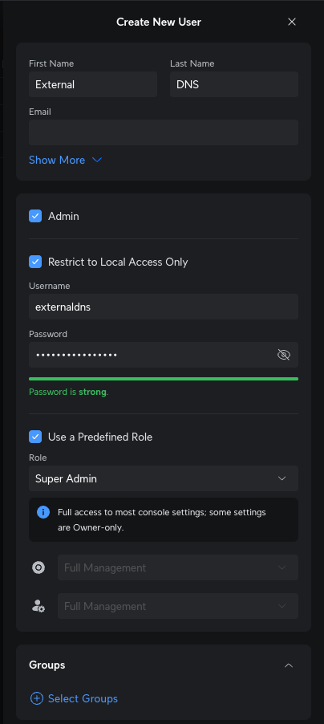
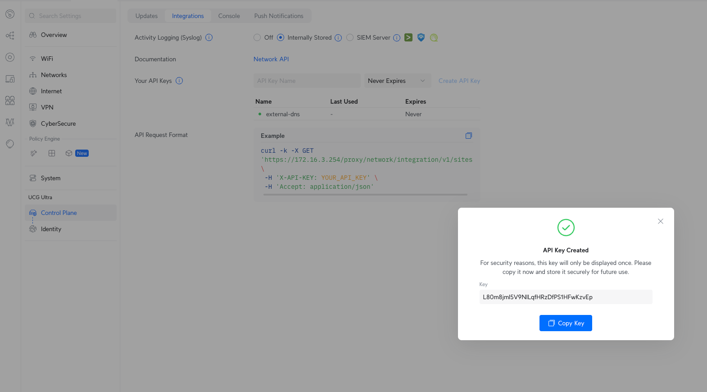
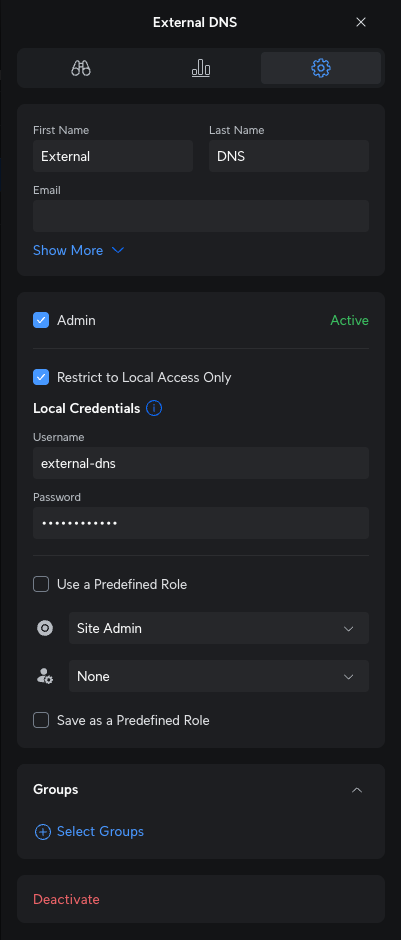

# ExternalDNS Webhook Provider for UniFi

[](https://github.com/home-operations/external-dns-unifi-webhook/actions/workflows/tests.yaml)
[](https://github.com/home-operations/external-dns-unifi-webhook/actions/workflows/lint.yaml)
[](https://github.com/home-operations/external-dns-unifi-webhook/releases)
[](LICENSE)
[](https://discord.gg/home-operations)

[ExternalDNS](https://github.com/kubernetes-sigs/external-dns) is a Kubernetes add-on for automatically managing DNS records for Kubernetes ingresses and services by using different DNS providers. This webhook provider allows you to automate DNS records from your Kubernetes clusters into your UniFi Network controller.

## 🎯 Requirements

- ExternalDNS >= v0.14.0
- UniFi OS >= 3.x
- UniFi Network >= 10.3.58

## 🚫 Limitations

_UniFi uses [dnsmasq](https://dnsmasq.org) as the backend of it's dns resolver and dhcp server._
_This project is subject to the limitations of dnsmasq. Please report any issues you encounter utilizing this provider._

- Wildcard and Duplicate CNAME Records are not supported by UniFi.
    - \*.example.com 0 IN CNAME internal.example.com
    - deployment.example.com 0 IN CNAME external.example.com internal.example.com

## ⛵ Deployment

### Creating UniFi Credentials

Authentication uses a UniFi API Key (Network 9.0.0+). Username & password authentication is no longer supported.

1. Open your UniFi controller/Console's admin page either via [unifi.ui.com](https://unifi.ui.com) or via the IP address of your controller

2. On the left navigation bar (that runs the length of the page) click the _people_ icon (`Admin & Users`)

3. Click `+ Create New` at the top of the page and fill it out using the below details

| Field Name                    | Value                                   |
| ----------------------------- | --------------------------------------- |
| First name                    | `External`                              |
| Last name                     | `DNS`                                   |
| Admin                         | :white_check_mark:                      |
| Restrict to local access only | :white_check_mark:                      |
| Username                      | `externaldns`                           |
| Password                      | Make up a password, but make note of it |
| Use a pre defined role        | :white_check_mark:                      |
| Role                          | `Super Admin`                           |

Your user should now look like the below



4. Login to your console as the user you have just created. This will need to be done via the controller's IP address

5. **Gear Icon** > **Control Plane** > **Integrations**

Give the API key a name, something like `external-dns`

Copy this Key, we will need it later. Your page should now look like the below



6. Remove elevated permissions from the user

Log back in as your normal account, head over to where we created the External DNS account
(On the left navigation bar (that runs the length of the page) click the _people_ icon (`Admin & Users`))

Open that account, click the **Gear Icon** then match the below

We have unselected **Use a Predefined Role** and changed the _ufo_ icon to `Site admin` and the _person_ to `None`



You're probably thinking _wow, that was long_, and it's because only super admins can create API Keys, but they do not need
those permissions the entire time to be able to _have_ API Key attached to that user. It's a ~bug~ feature in UniFi

The `Site Admin` permissions are more than enough to allow that user to create and manage DNS records in our controller

7. Create a Kubernetes secret called `external-dns-unifi-secret` that will hold your `UNIFI_API_KEY` with their respected values from Step 3.

```yaml
---
apiVersion: v1
kind: Secret
metadata:
    name: external-dns-unifi-secret
stringData:
    api-key: <your-api-key>
```

You should now follow the [Installing the provider](#installing-the-provider) instructions

### Installing the provider

1. Add the ExternalDNS Helm repository to your cluster.

    ```sh
    helm repo add external-dns https://kubernetes-sigs.github.io/external-dns/
    ```

2. Deploy your `external-dns-unifi-secret` secret that holds your authentication credentials from either of the credential types above.

3. Create the helm values file, for example `external-dns-unifi-values.yaml`:

    ```yaml
    fullnameOverride: external-dns-unifi
    logLevel: &logLevel debug
    provider:
        name: webhook
        webhook:
            image:
                repository: ghcr.io/home-operations/external-dns-unifi-webhook
                tag: main # replace with a versioned release tag
            env:
                - name: UNIFI_HOST
                  value: https://192.168.1.1 # replace with the address to your UniFi router/controller
                - name: UNIFI_API_KEY
                  valueFrom:
                      secretKeyRef:
                          name: external-dns-unifi-secret
                          key: api-key
                - name: LOG_LEVEL
                  value: *logLevel
            livenessProbe:
                httpGet:
                    path: /healthz
                    port: http-webhook
                initialDelaySeconds: 10
                timeoutSeconds: 5
            readinessProbe:
                httpGet:
                    path: /readyz
                    port: http-webhook
                initialDelaySeconds: 10
                timeoutSeconds: 5
    extraArgs:
        - --ignore-ingress-tls-spec
    policy: create-only
    sources: ["ingress", "service"]
    txtOwnerId: default
    txtPrefix: k8s.
    domainFilters: ["example.com"] # replace with your domain
    ```

    For additional customization, refer to the [helm values](https://github.com/kubernetes-sigs/external-dns/blob/master/charts/external-dns/values.yaml).

4. Install the Helm chart

    ```sh
    helm install external-dns-unifi external-dns/external-dns -f external-dns-unifi-values.yaml --version 1.15.0 -n external-dns
    ```

## Configuration

### Unifi Controller Configuration

| Environment Variable    | Description                                                                           | Default Value |
| ----------------------- | ------------------------------------------------------------------------------------- | ------------- |
| `UNIFI_API_KEY`         | The local API key provided for your user (required).                                  | N/A           |
| `UNIFI_SKIP_TLS_VERIFY` | Whether to skip TLS verification (true or false).                                     | `true`        |
| `UNIFI_CA_CERT`         | Path to a PEM file with extra trusted CAs (alternative to skipping verification).     | N/A           |
| `UNIFI_SITE`            | Unifi site name (e.g. `default`) or site UUID. Resolved to the API's UUID at startup. | `default`     |
| `UNIFI_HOST`            | Host of the Unifi Controller (must be provided).                                      | N/A           |
| `LOG_LEVEL`             | Change the verbosity of logs (used when making a bug report)                          | `info`        |

The webhook talks to the UniFi Network [Integration API](https://developer.ui.com/network/) over the controller's local `/proxy/network/integration/v1/...` paths. External / cloud-proxied controllers are not supported — point `UNIFI_HOST` at the controller directly.

### Server Configuration

| Environment Variable         | Description                                                         | Default Value     |
| ---------------------------- | ------------------------------------------------------------------- | ----------------- |
| `SERVER_HOST`                | Host address for the webhook server.                                | `localhost`       |
| `SERVER_PORT`                | Port for the webhook server.                                        | `8888`            |
| `SERVER_READ_TIMEOUT`        | Read timeout for the webhook server.                                | `60s`             |
| `SERVER_READ_HEADER_TIMEOUT` | Read-header timeout (Slowloris mitigation).                         | `5s`              |
| `SERVER_WRITE_TIMEOUT`       | Write timeout for the webhook server.                               | `60s`             |
| `SERVER_IDLE_TIMEOUT`        | Keep-alive idle timeout.                                            | `120s`            |
| `SERVER_MAX_HEADER_BYTES`    | Maximum request header size.                                        | `65536`           |
| `SERVER_MAX_BODY_BYTES`      | Maximum POST body size before returning 413.                        | `5242880` (5 MiB) |
| `HEALTH_SERVER_ADDR`         | Address for the /metrics, /healthz, /readyz server.                 | `0.0.0.0:8080`    |
| `READINESS_CACHE_TTL`        | How long /readyz caches the upstream probe result.                  | `30s`             |
| `PPROF_ENABLED`              | Mount /debug/pprof/\* on the health server (do not enable in prod). | `false`           |
| `UNIFI_APPLY_WORKERS`        | Maximum concurrent record operations during ApplyChanges.           | `5`               |
| `UNIFI_RETRY_ATTEMPTS`       | Total attempts per request (including the first).                   | `3`               |
| `UNIFI_RETRY_INITIAL_DELAY`  | Initial backoff before the first retry.                             | `500ms`           |
| `UNIFI_RETRY_MAX_DELAY`      | Maximum backoff between retries (also caps Retry-After).            | `10s`             |
| `LOG_LEVEL`                  | Log verbosity (debug / info / warn / error).                        | `info`            |
| `LOG_FORMAT`                 | Set to `text` for human-readable text output instead of JSON.       | JSON              |

> **Domain filtering**: configure `--domain-filter` (and friends) on the external-dns controller itself, not on this webhook. UniFi has no zone concept the webhook could narrow against, so we follow the [external-dns `GetDomainFilter` contract](https://github.com/kubernetes-sigs/external-dns/blob/v0.21.0/docs/contributing/sources-and-providers.md#implementing-getdomainfilter) and leave the filter to the controller.

## ⭐ Stargazers

<div align="center">

[](https://star-history.com/#home-operations/external-dns-unifi-webhook&Date)

</div>

---

## 🤝 Gratitude and Thanks

Thanks to all the people who donate their time to the [Home Operations](https://discord.gg/home-operations) Discord community.
